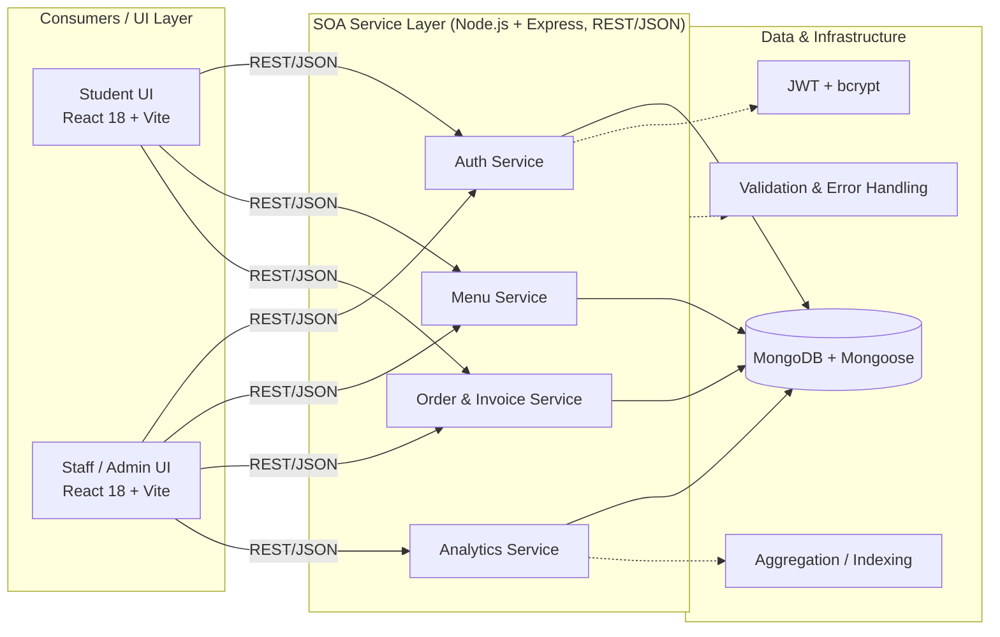
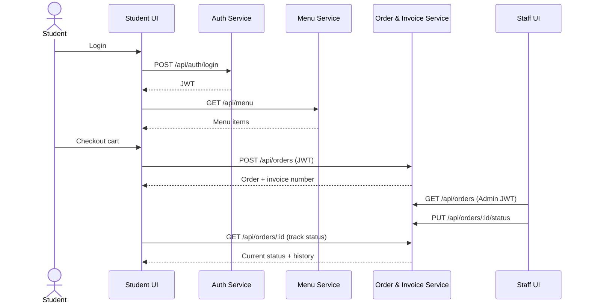

# 🍽️ Campus Canteen — College Food Ordering System

**An SOA-oriented full-stack application for college canteen management.**

Students browse the menu, place pickup orders and receive invoice numbers. Canteen staff manage the menu, fulfil incoming orders and view analytics. The business capabilities are organised as four cohesive **services** — Authentication, Menu, Order & Invoice, and Analytics — each exposed through a REST/JSON interface and consumed by role-specific clients.

> **Course:** SOA Programming and Microservices (24SDCS03) · Department of CSE, KLH Bowrampet Campus

---

## 📑 Table of Contents

1. [SOA Overview](#-soa-overview)
2. [Architecture](#-architecture)
3. [Service Catalog](#-service-catalog)
4. [Service Contracts (REST APIs)](#-service-contracts-rest-apis)
5. [Service Interaction & Order Flow](#-service-interaction--order-flow)
6. [SOA Principles Applied](#-soa-principles-applied)
7. [Security & Cross-Cutting Concerns](#-security--cross-cutting-concerns)
8. [Consumers (Client Layer)](#-consumers-client-layer)
9. [Tech Stack](#-tech-stack)
10. [Setup Instructions](#-setup-instructions)
11. [Demo Login Credentials](#-demo-login-credentials)
12. [Project Structure (Mapped to Services)](#-project-structure-mapped-to-services)
13. [Current Scope & Future Work](#-current-scope--future-work)
14. [License](#-license)

---

## 🧭 SOA Overview

Running a college canteen involves several connected activities: menu discovery, authentication, ordering, invoice generation, status tracking and staff processing. When these are handled as disconnected steps, students lack visibility after ordering and staff lack a structured way to process orders.

This project addresses that by exposing each business capability as a **service with a clear interface**:

| Business capability | Service | Consumers |
|---|---|---|
| Who is the user and what may they do? | **Authentication Service** | Student UI, Staff UI |
| What food is available? | **Menu Service** | Student UI, Staff UI |
| Place, track and fulfil an order; issue invoice | **Order & Invoice Service** | Student UI, Staff UI |
| What is popular, and how is the canteen performing? | **Analytics Service** | Staff UI (and public popular-dishes view) |

**Goals**

- Identify cohesive service boundaries
- Expose REST/JSON interfaces
- Apply role-based authorization
- Separate UI, business logic and persistence
- Support reusable service operations
- Keep service responsibilities understandable and testable

---

## 🏗️ Architecture

The system follows a **three-layer architecture**: consumers, a service layer, and data & infrastructure.



| Layer | Responsibility | Implemented with |
|---|---|---|
| **Consumers / UI** | Student and staff interfaces, role-based navigation | React.js 18, Vite, Tailwind CSS, Chart.js |
| **Service layer** | Business logic exposed as REST/JSON operations | Node.js, Express.js |
| **Data & infrastructure** | Persistence, authentication, validation, aggregation, indexing | MongoDB, Mongoose, JWT, bcrypt |

---

## 🧩 Service Catalog

### 1. 🔐 Authentication Service
**Responsibility:** register users, authenticate them, issue JWTs and expose the caller's profile. Enforces the Student / Canteen Staff roles.

- Separate Student and Canteen Staff registration/login
- Admin registration requires canteen name, phone number and password
- Passwords hashed with bcrypt; tokens issued as JWT
- **Code:** `routes/auth.js`, `controllers/authController.js`, `models/User.js`, `middleware/auth.js`

### 2. 🍔 Menu Service
**Responsibility:** manage and serve canteen menu items.

- Browse with search, category filter, price range, sorting and pagination
- Full CRUD for staff
- Categories: Veg, Non-Veg, Snacks, Desserts, Beverages, Main Course
- MongoDB text index on item names for fast search
- **Code:** `routes/menu.js`, `controllers/menuController.js`, `models/MenuItem.js`

### 3. 🧾 Order & Invoice Service
**Responsibility:** create orders, generate unique invoice numbers, track status and support staff processing.

- Students place pickup orders with phone number and optional notes
- Every order receives a unique invoice number in the form `INV-YYYYMMDD-NNNN` (auto-incrementing MongoDB counter)
- Status lifecycle with timestamped `statusHistory` for traceability
- Students can view their orders and cancel; staff can view all incoming orders and update status
- **Code:** `routes/orders.js`, `controllers/orderController.js`, `models/Order.js`

### 4. 📊 Analytics Service
**Responsibility:** turn order data into insights for canteen staff.

- Popular dishes, order-status statistics, revenue summary
- Implemented with MongoDB aggregation
- **Code:** `routes/analytics.js`, `controllers/analyticsController.js`

---

## 📡 Service Contracts (REST APIs)

All services are exposed as REST endpoints returning JSON. The **Auth** column is the access policy enforced by the service.

### Authentication Service — `/api/auth`

| Method | Endpoint | Description | Auth |
|---|---|---|---|
| POST | `/api/auth/register` | Register new user | No |
| POST | `/api/auth/login` | Login | No |
| GET | `/api/auth/profile` | Get user profile | Required |

### Menu Service — `/api/menu`

| Method | Endpoint | Description | Auth |
|---|---|---|---|
| GET | `/api/menu` | List items (paginated) | No |
| GET | `/api/menu/:id` | Get single item | No |
| GET | `/api/menu/categories/list` | Get all categories | No |
| POST | `/api/menu` | Create item | Admin |
| PUT | `/api/menu/:id` | Update item | Admin |
| DELETE | `/api/menu/:id` | Delete item | Admin |

**Query parameters for `GET /api/menu`**

| Param | Description | Example |
|---|---|---|
| `search` | Search items by name | `?search=chicken` |
| `category` | Filter by category | `?category=veg` |
| `minPrice` | Minimum price filter | `?minPrice=100` |
| `maxPrice` | Maximum price filter | `?maxPrice=500` |
| `sort` | `price_asc`, `price_desc`, `popular`, `rating`, `latest` | `?sort=popular` |
| `page` | Page number | `?page=2` |
| `limit` | Items per page | `?limit=12` |

### Order & Invoice Service — `/api/orders`

| Method | Endpoint | Description | Auth |
|---|---|---|---|
| POST | `/api/orders` | Create order | Student |
| GET | `/api/orders/my` | Get my orders | Student |
| GET | `/api/orders/:id` | Get order details | Owner / Admin |
| GET | `/api/orders/:id/invoice` | Get order invoice | Owner / Admin |
| GET | `/api/orders` | Get all orders | Admin |
| PUT | `/api/orders/:id/status` | Update order status | Admin |
| PUT | `/api/orders/:id/cancel` | Cancel order | Student |

### Analytics Service — `/api/analytics`

| Method | Endpoint | Description | Auth |
|---|---|---|---|
| GET | `/api/analytics/popular` | Popular dishes | No |
| GET | `/api/analytics/orders` | Order statistics | Admin |
| GET | `/api/analytics/revenue` | Revenue summary | Admin |

---

## 🔄 Service Interaction & Order Flow

A complete order touches several services in sequence:



| Step | Actor | Service call | Result |
|---|---|---|---|
| 1 | Student UI | Login / browse menu | Session established |
| 2 | Auth + Menu | Validate identity / retrieve items | Menu shown |
| 3 | Order Service | Create order + invoice | Invoice number issued |
| 4 | Staff UI | Read incoming order | Order visible with student details |
| 5 | Order Service | Update status | Status history recorded |
| 6 | Student UI | Track pickup status | Live status shown |

### Order Status Flow

```
Pending → Preparing → Ready for Pickup → Picked Up (Delivered)
   ↓
Cancelled
```

Each status change is recorded with a timestamp in the order's `statusHistory` array.

### Invoice Numbers

Format: `INV-YYYYMMDD-NNNN` — e.g. `INV-20260328-0001`

- Students see the invoice number on the order tracking page
- Staff see the invoice number plus student name and phone on the incoming orders page
- Students show the invoice number to canteen staff for pickup

---

## 📐 SOA Principles Applied

| Principle | How it appears in this project |
|---|---|
| **Standardized service contract** | Every capability is a documented REST/JSON endpoint with a defined method, path and access policy |
| **Loose coupling** | UI, business logic and persistence are separate; clients depend only on the REST interface, not on internals |
| **Service abstraction** | Clients call endpoints such as `POST /api/orders`; invoice numbering, validation and storage details are hidden behind them |
| **Reusability** | The same Menu and Order operations serve both the Student and Staff clients |
| **Autonomy / cohesion** | Each service owns one business area, with its own routes, controller and model |
| **Statelessness** | Requests carry a JWT; the service layer holds no session state between calls |
| **Discoverability** | The service catalog and API contracts are documented in this README |
| **Composability** | Higher-level workflows (placing an order) are composed from Auth, Menu and Order services |

---

## 🛡️ Security & Cross-Cutting Concerns

Concerns shared across services are handled once, in middleware and infrastructure, rather than repeated in each service.

- **Authentication:** JWT verification middleware (`middleware/auth.js`)
- **Authorization:** role-based guards — admin-only routes for menu changes, order management and analytics; student-only routes for placing and cancelling orders
- **Password security:** bcrypt hashing with salt rounds
- **Input validation:** server-side validation on all endpoints
- **Error handling:** centralized error-handler middleware (`middleware/errorHandler.js`) for consistent error responses
- **Traceability:** timestamped order `statusHistory`
- **Performance:** MongoDB text index for search; aggregation pipelines for analytics

---

## 🖥️ Consumers (Client Layer)

The React client is a consumer of the service layer and contains no business rules of its own.

### 🎓 Student Interface
- Browse menu with search, filter and sort
- Shopping cart with add/remove and quantity adjustment (persisted in `localStorage`)
- Place orders with phone number and optional notes
- Order tracking with status updates, and order history with invoice numbers

### 🏪 Canteen Staff (Admin) Interface
- Incoming orders with customer name, email, phone and invoice number
- Order management: Start Preparing → Ready for Pickup → Mark Picked Up
- Orders page auto-refreshes every 15 seconds (polling)
- Menu management (Create, Read, Update, Delete)
- Analytics dashboard: bar chart of popular dishes, doughnut chart of order status, line chart of monthly revenue

### 🔐 Role-Based Access
- Separate Login/Register tabs for Student and Canteen Staff
- Route protection: admins cannot access ordering pages, students cannot access admin pages
- Role-based navigation (`Navbar.jsx`, `ProtectedRoute.jsx`)

### 📱 Progressive Web App
- Installable via "Add to Home Screen"
- Offline-capable with Service Worker caching
- App-like splash screen and native feel

---

## 🧰 Tech Stack

| Layer | Technology |
|---|---|
| Frontend (consumers) | React.js 18 + Tailwind CSS + Chart.js |
| Service layer | Node.js + Express.js (REST/JSON) |
| Persistence | MongoDB + Mongoose ODM |
| Authentication | JWT (JSON Web Tokens) + bcrypt |
| Build tool | Vite |
| PWA | Service Worker + Web App Manifest |

---

## 🚀 Setup Instructions

### Prerequisites
- Node.js v16 or higher
- MongoDB Community Edition

### Step 1: Clone the repository
```bash
git clone <repository-url>
cd FSAD
```

### Step 2: Install backend (service layer) dependencies
```bash
cd backend
npm install
```

### Step 3: Configure environment variables
Edit `backend/.env`:

```env
PORT=5000
MONGODB_URI=mongodb://localhost:27017/foodie-express
JWT_SECRET=your_secret_key_here
NODE_ENV=development
```

### Step 4: Seed the database
```bash
cd backend
node seed/seedData.js
```

This creates:
- 3 users (1 canteen admin + 2 students)
- 25 menu items across 6 categories
- 3 sample orders with different statuses

### Step 5: Install frontend dependencies
```bash
cd frontend
npm install
```

### Step 6: Start the application

**Terminal 1 — Service layer (backend):**
```bash
cd backend
npm run dev
```
Services start at `http://localhost:5000`

**Terminal 2 — Client (frontend):**
```bash
cd frontend
npm run dev
```
App opens at `http://localhost:3000`

---

## 📋 Demo Login Credentials

| Role | Email | Password |
|---|---|---|
| 🏪 Canteen Staff | `admin@canteen.com` | `admin123` |
| 🎓 Student 1 | `john@example.com` | `user123` |
| 🎓 Student 2 | `jane@example.com` | `user123` |

---

## 📂 Project Structure (Mapped to Services)

```
FSAD/
├── README.md
│
├── backend/                          # SOA service layer (Node.js + Express)
│   ├── config/
│   │   └── db.js                     # MongoDB connection (shared infrastructure)
│   ├── controllers/                  # Service business logic
│   │   ├── authController.js         # ── Auth Service
│   │   ├── menuController.js         # ── Menu Service
│   │   ├── orderController.js        # ── Order & Invoice Service
│   │   └── analyticsController.js    # ── Analytics Service
│   ├── middleware/                   # Cross-cutting concerns
│   │   ├── auth.js                   # JWT verification + admin check
│   │   └── errorHandler.js           # Global error handler
│   ├── models/                       # Persistence schemas
│   │   ├── User.js                   # Auth Service (bcrypt + canteenName for admin)
│   │   ├── MenuItem.js               # Menu Service (text index)
│   │   └── Order.js                  # Order Service (invoice number + status history)
│   ├── routes/                       # Service interfaces (REST endpoints)
│   │   ├── auth.js                   # /api/auth
│   │   ├── menu.js                   # /api/menu
│   │   ├── orders.js                 # /api/orders (+ invoice)
│   │   └── analytics.js              # /api/analytics
│   ├── seed/
│   │   └── seedData.js               # Database seeder (25 items + users)
│   ├── .env                          # Environment variables
│   ├── package.json
│   └── server.js                     # Express entry point (mounts all services)
│
└── frontend/                         # Consumer layer (React + Vite SPA)
    ├── public/
    │   ├── manifest.json             # PWA manifest
    │   ├── sw.js                     # Service worker
    │   └── icons/                    # App icons
    ├── src/
    │   ├── api/
    │   │   └── axios.js              # Service client with JWT interceptor
    │   ├── context/
    │   │   ├── AuthContext.jsx       # Auth state & JWT management
    │   │   └── CartContext.jsx       # Shopping cart state (localStorage)
    │   ├── components/
    │   │   ├── Navbar.jsx            # Role-based navigation (Student vs Staff)
    │   │   ├── Footer.jsx            # Footer with canteen info
    │   │   ├── FoodCard.jsx          # Menu item card component
    │   │   ├── Pagination.jsx        # Reusable pagination
    │   │   ├── SearchFilter.jsx      # Search, category, price filters
    │   │   └── ProtectedRoute.jsx    # Auth guard for routes
    │   ├── pages/
    │   │   ├── Home.jsx              # Student landing page
    │   │   ├── Menu.jsx              # Browse menu with filters
    │   │   ├── Cart.jsx              # Shopping cart
    │   │   ├── Checkout.jsx          # Place order form (canteen pickup)
    │   │   ├── Login.jsx             # Login with Student/Staff tabs
    │   │   ├── Register.jsx          # Register with Student/Staff tabs
    │   │   ├── MyOrders.jsx          # Order history with invoice numbers
    │   │   ├── OrderTracking.jsx     # Order tracking + invoice display
    │   │   └── admin/
    │   │       ├── Dashboard.jsx     # Analytics charts
    │   │       ├── ManageMenu.jsx    # CRUD menu items
    │   │       └── ManageOrders.jsx  # Incoming orders with student details
    │   ├── App.jsx                   # Role-based routes configuration
    │   ├── main.jsx                  # React entry + context providers
    │   └── index.css                 # Global styles + PWA optimizations
    ├── index.html                    # HTML + PWA meta tags
    ├── vite.config.js                # Vite + proxy configuration
    ├── tailwind.config.js            # Tailwind theme (orange palette)
    └── package.json
```

---

## 🔭 Current Scope & Future Work

**Current scope:** the four services are separate service areas — each with its own routes, controller and model — exposed through REST/JSON. They are currently hosted by a single Express server and share one MongoDB database.

**Future work**

- Add approved academic SOA literature and references
- Expand automated testing (per-service unit and integration tests)
- Add deployment and observability evidence (logging, monitoring)
- Validate service interactions and integration end to end
- Explore deploying services independently (e.g. an API gateway with separately deployed services)

---

## 📝 License

MIT License — free to use for learning and development.
